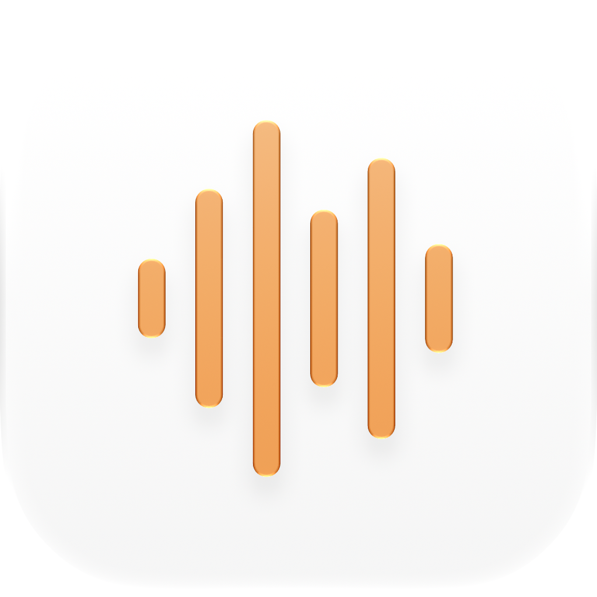
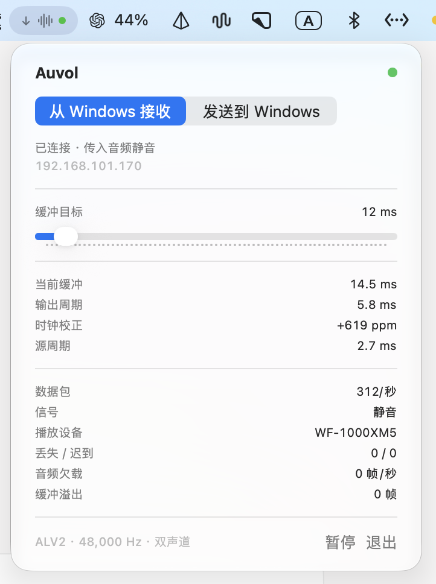
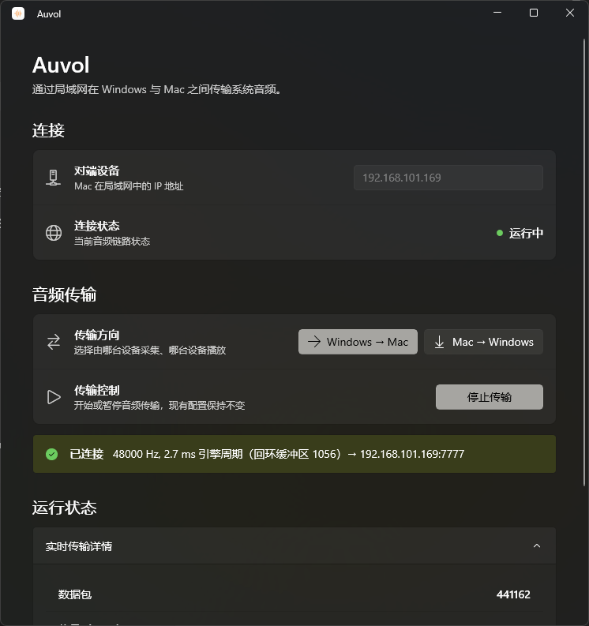

<p align="center">
  
</p>

<h1 align="center">Auvol</h1>

<p align="center">
  Stream system audio between Windows and Mac over your LAN.<br>
  Low latency, uncompressed PCM, either direction, and native apps on both sides.
</p>


<p align="center">
  <a href="https://github.com/imeelinew/Auvol/releases">Download</a> ·
  <a href="#install">Install</a> ·
  <a href="#build-from-source">Build from source</a>
</p>

<p align="center">
  <a href="README.en.md">English</a>
  <a href="README.md">简体中文</a>
</p>

<p align="center">
  <a href="https://github.com/imeelinew/Auvol/releases/latest"></a>
  
  
  
  
</p>

---

<p align="center">
  
</p>

## About

Auvol is a LAN system-audio transport for people who want Windows sound on Mac headphones in real time, or Mac audio played through a Windows output device.

The Mac app shows connection state, direction, buffer target, and live metrics such as current buffer, output period, clock correction, and source period, plus playback device, signal level, and packet stats. Exactly one direction is active at a time: Windows → Mac or Mac → Windows. There is no codec in the path—only stereo float32 PCM. During a stable 48 kHz stream, the only sample-rate work is the tiny clock correction required because two physical audio devices never run at exactly the same rate.

## Why Auvol

Cross-device system audio usually means Bluetooth, HDMI, or a compressed remote-desktop / screen-share path. Auvol turns that into a dedicated LAN audio link: one side captures system output, the other plays to the default device, with latency kept in the millisecond range when the network allows.

- **LAN first**: raw PCM over UDP on gigabit Ethernet or solid Wi‑Fi.
- **Either direction**: the same apps cover send and receive; switch roles while running.
- **Uncompressed quality**: ALV2 carries 48 kHz stereo float32 with no lossy encode.
- **Native on both sides**: a native macOS window and a WinUI 3 Windows app keep status and controls local.
- **Observable link**: buffer target, clock correction, lost / late packets, underruns, and overflows stay visible so you can tune latency to the lowest stable point.

## Windows

<p align="center">
  
</p>

The Windows app uses WinUI 3 for peer IP, connection status, direction, and start / stop. Send mode captures the current default output via WASAPI loopback; receive mode plays to the current default output device.

## Select a direction

On Windows, choose a role and press **Start** once. Changing direction while Auvol is running switches roles immediately—no need to stop first.

- **Windows → Mac**: capture the current Windows default output and play it on Mac.
- **Mac → Windows**: capture Mac system audio and play it on the current Windows default output; pick the Bluetooth headset in Windows sound settings first if needed.

On Mac, choose **Receive from Windows** or **Send to Windows**. Mac send requires a one-time system-audio capture permission.

For unattended Windows launch:

```sh
Auvol.exe --send <mac-ip>
Auvol.exe --receive <mac-ip>
```

Windows remembers the peer IP, selected direction, and whether transport was running. After the first launch, it can start at the next sign-in and resume an active session. Stop or closing the window records a paused state, so the next sign-in opens Auvol idle.

## More features

- Half-duplex real-time transport: exactly one direction at a time
- ALV2 raw stereo float32 PCM with stream identity, packet sequence, and sender frame positions
- Default jitter target around 12 ms, tunable to the link
- Automatic recovery from default-device changes, Bluetooth disconnects, and brief WASAPI / Core Audio failures
- Mac UI exposes queue depth, clock correction, loss, underrun, and overflow timing
- Start / Stop is a global pause control, not a recovery procedure

## Install

Download the latest build from the [Releases page](https://github.com/imeelinew/Auvol/releases), install the macOS and Windows clients, then enter the peer IP on the same LAN and pick a direction.

## Build from source

`deploy.sh` regenerates the Xcode project, builds both apps, installs the WinUI app under `%LOCALAPPDATA%\Auvol`, and restarts both sides. The Windows source workspace is synchronized to `C:\dev\Auvol\windows` and built with Visual Studio's x64 C++ toolchain.

```sh
# Same LAN: preferred
WIN_HOST=eli-lan ./deploy.sh

# Remote through Surge Tailscale
./deploy.sh
```

After deployment, the new Windows app launches automatically. During normal use, device changes and brief audio failures recover automatically. ALV1 and ALV2 are intentionally incompatible.

See [`PROTOCOL.md`](PROTOCOL.md) for the wire format.
